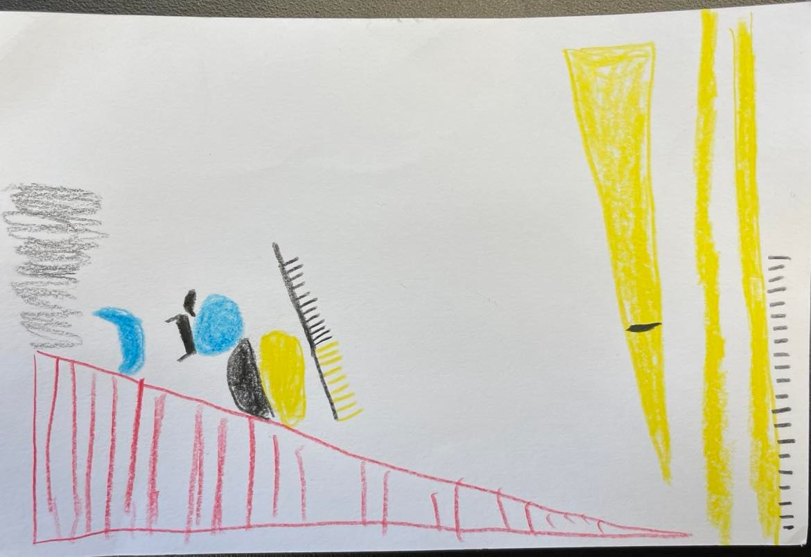

# David Wu

## Data Selfie
My data selfie following [this guide](https://ideas.ted.com/how-to-draw-your-own-selfie-using-your-personal-data/)

## About Me

My name is David Wu and I am a current fourth year joint Bx/MS student in the computer science program. 
For my undergraduate degree, I study math and computer science. 
I am originally from South Florida, and enjoy hiking, basketball, and coding.
I also enjoy trying new foods from around the world, and hope to be able to sightsee more in the future!
